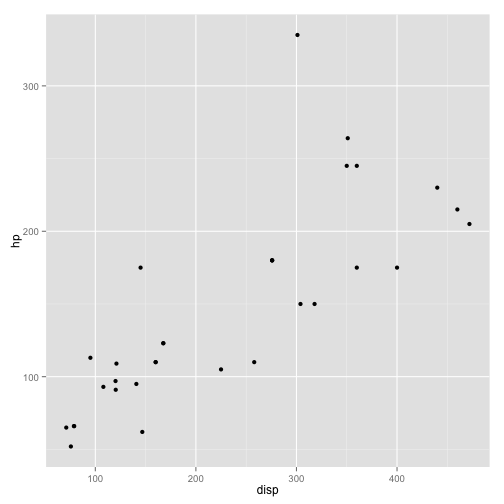
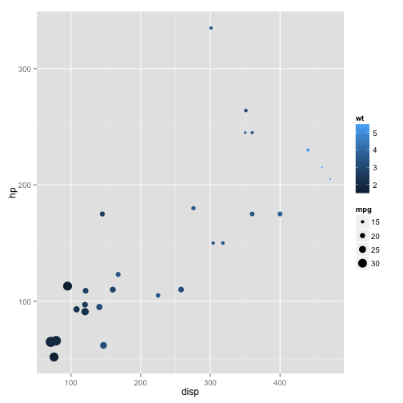

<!--
%% \VignetteEngine{knitr::rmarkdown}
%\VignetteIndexEntry{02 ggplot2 Introduction}
-->


# Introduction

The `CRANpkg('ggplot2')` package is a relatively novel approach to generating highly informative publication-quality graphics. The "gg" stands for "Grammar of Graphics". In short, instead of thinking about a single function that produces a plot, `CRANpkg('ggplot2')` uses a "grammar" approach, akin to building more and more complex sentences to layer on more information or nuance. 

# Data Model

The `CRANpkg('ggplot2')` package assumes that data are in the form of a data.frame. In some cases, the data will need to be manipulated into a form that matches assumptions that `CRANpkg('ggplot2')` uses.  In particular, if one has a *matrix* of numbers associated with different subjects (samples, people, etc.), the data will usually need to be transformed into a "long" data frame. 

# Getting started

To use the `CRANpkg('ggplot2')` package, it must be installed and loaded. Assuming that installation has been done already, we can load the package directly:


```r
library(ggplot2)
```

# Playing with ggplot2

## mtcars data

We are going to use the mtcars dataset, included with R, to experiment with `CRANpkg('ggplot2')`.  


```r
data(mtcars)
```

- Exercise: Explore the `mtcars` dataset using `View`, `summary`, `dim`, `class`, etc.

We can also take a quick look at the relationships between the variables using the `pairs` plotting function.


```r
pairs(mtcars)
```

That is a useful view of the data. We want to use `CRANpkg('ggplot2')` to make an informative plot, so let's approach this in a piecewise fashion.  We first need to decide what type of plot to produce and what our basic variables will be.  In this case, we have a number of choices.  


```r
ggplot(mtcars,aes(x=disp,y=hp))
```

First, a little explanation is necessary.  The `ggplot` function takes as its first argument a `data.frame`.  The second argument is the "aesthetic", `aes`.  The `x` and `y` take column names from the `mtcars` `data.frame` and will form the basis of our scatter plot. 

But why did we get that "Error: No layers in plot"? Remember that *ggplot2* is a "grammar of graphics". We supplied a subject, but no verb (called a *layer* by ggplot2). So, to generate a plot, we need to supply a verb.  There are many possibilities. Each "verb" or *layer* typically starts with "geom" and then a descriptor. An example is necessary.


```r
ggplot(mtcars,aes(x=disp,y=hp)) + geom_point()
```

 

We finally produced a plot. The power of *ggplot2*, though, is the ability to make very rich plots by adding "grammar" to the "plot sentence". We have a number of other variables in our `mtcars` `data.frame`. How can we add another value to a two-dimensional plot?


```r
ggplot(mtcars,aes(x=disp,y=hp,color=cyl)) + geom_point()
```

 

The color of the points is a based on the numeric variable `wt`, the weight of the car. Can we do more? We can change the size of the points, also.


```r
ggplot(mtcars,aes(x=disp,y=hp,color=wt,size=mpg)) + geom_point()
```

 

So, on our 2D plot, we are now plotting four variables.  Can we do more? We can manipulate the shape of the points in addition to the color and the size.


```r
ggplot(mtcars,aes(x=disp,y=hp)) + geom_point(aes(size=mpg,color=wt,shape=cyl))
```

Why did we get that error? Ggplot2 is trying to be helpful by telling us that a "continuous varialbe cannot be mapped to 'shape'". Well, in our `mtcars` `data.frame`, we can look at `cyl` in detail.


```r
class(mtcars$cyl)
```

```
## [1] "numeric"
```

```r
summary(mtcars$cyl)
```

```
##    Min. 1st Qu.  Median    Mean 3rd Qu.    Max. 
##   4.000   4.000   6.000   6.188   8.000   8.000
```

```r
table(mtcars$cyl)
```

```
## 
##  4  6  8 
## 11  7 14
```

The `cyl` variable is "kinda" continuous in that it is numeric, but it could also be thought of as a "category" of engines. R has a specific data type for "category" data, called a *factor*. We can easily convert the `cyl` column to a factor like so:


```r
mtcars$cyl = as.factor(mtcars$cyl)
```

Now, we can go ahead with our previous approach to make a 2-dimensional plot that displays the relationships between *five* variables.


```r
ggplot(mtcars,aes(x=disp,y=hp)) + geom_point(aes(size=mpg,color=wt,shape=cyl))
```

 

## NYC Flight data

I leave this section open-ended for you to explore further options with the *ggplot2* package.  The data represent the on-time data for all flights that departed New York City in 2013.


```r
library(nycflights13)
head(flights)
```

```
##   year month day dep_time dep_delay arr_time arr_delay carrier tailnum
## 1 2013     1   1      517         2      830        11      UA  N14228
## 2 2013     1   1      533         4      850        20      UA  N24211
## 3 2013     1   1      542         2      923        33      AA  N619AA
## 4 2013     1   1      544        -1     1004       -18      B6  N804JB
## 5 2013     1   1      554        -6      812       -25      DL  N668DN
## 6 2013     1   1      554        -4      740        12      UA  N39463
##   flight origin dest air_time distance hour minute
## 1   1545    EWR  IAH      227     1400    5     17
## 2   1714    LGA  IAH      227     1416    5     33
## 3   1141    JFK  MIA      160     1089    5     42
## 4    725    JFK  BQN      183     1576    5     44
## 5    461    LGA  ATL      116      762    5     54
## 6   1696    EWR  ORD      150      719    5     54
```

Feel free to explore. Consider using other "geoms" during your exploration.

# Session Info

```r
sessionInfo()
```

```
## R version 3.2.1 (2015-06-18)
## Platform: x86_64-apple-darwin13.4.0 (64-bit)
## Running under: OS X 10.10 (Yosemite)
## 
## locale:
## [1] en_US.UTF-8/en_US.UTF-8/en_US.UTF-8/C/en_US.UTF-8/en_US.UTF-8
## 
## attached base packages:
## [1] stats     graphics  grDevices utils     datasets  methods   base     
## 
## other attached packages:
## [1] nycflights13_0.1 ggplot2_1.0.1    BiocStyle_1.5.3  knitr_1.8       
## [5] Rgitbook_0.9    
## 
## loaded via a namespace (and not attached):
##  [1] Rcpp_0.11.6         knitcitations_1.0.6 MASS_7.3-40        
##  [4] munsell_0.4.2       colorspace_1.2-4    bibtex_0.4.0       
##  [7] stringr_0.6.2       httr_0.6.1          plyr_1.8.1         
## [10] tools_3.2.1         grid_3.2.1          gtable_0.1.2       
## [13] digest_0.6.8        RJSONIO_1.3-0       RefManageR_0.8.63  
## [16] reshape2_1.4        formatR_1.0         codetools_0.2-11   
## [19] RCurl_1.95-4.3      memoise_0.2.1       evaluate_0.5.5     
## [22] labeling_0.3        scales_0.2.4        XML_3.98-1.1       
## [25] lubridate_1.3.3     proto_0.3-10
```

  <script type="text/javascript">

    var _gaq = _gaq || [];
    _gaq.push(['_setAccount', 'UA-2851481-1']);
    _gaq.push(['_trackPageview']);

    (function() {
    var ga = document.createElement('script'); ga.type = 'text/javascript'; ga.async = true;
    ga.src = ('https:' == document.location.protocol ? 'https://' : 'http://') + 'stats.g.doubleclick.net/dc.js';
    var s = document.getElementsByTagName('script')[0]; s.parentNode.insertBefore(ga, s);
    })();

  </script>
  
